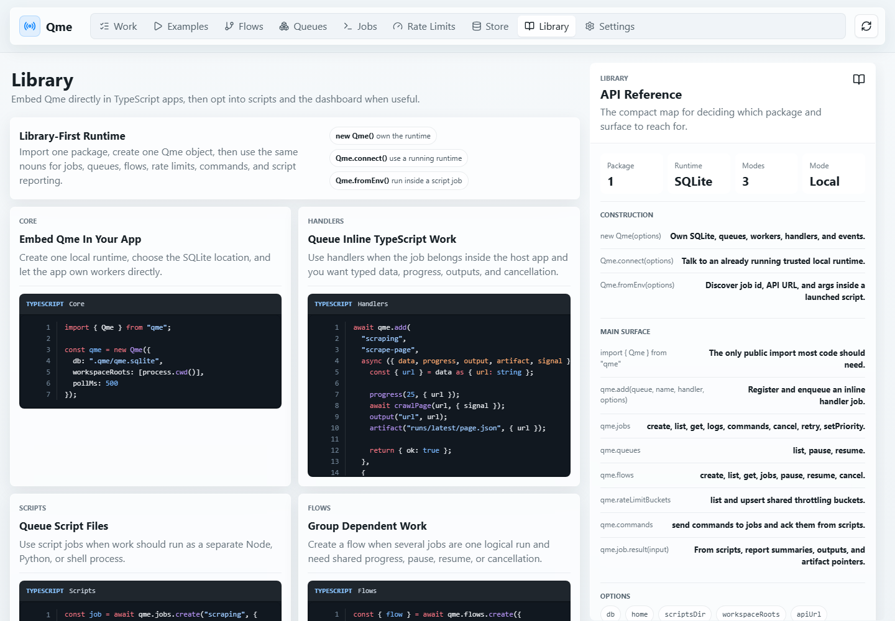

# Qme

Qme is a TypeScript-first local job queue for trusted apps. It can run embedded
inside a TypeScript app, and it can also expose the local HTTP API/dashboard when
you want multiple apps or a browser UI.

Try the static dashboard demo on GitHub Pages:
[Dashboard](https://santistebanc.github.io/Qme/) ·
[Library docs](https://santistebanc.github.io/Qme/?view=library)



## Embedded Library

```ts
import { Qme } from "qme";

const qme = new Qme({
  db: ".qme/qme.sqlite",
  workspaceRoots: [process.cwd()]
});

await qme.add(
  "scraping",
  "scrape-page",
  async ({ data, progress, output }) => {
    const input = data as { url: string };
    progress(25, { url: input.url });
    output("url", input.url);
    return { ok: true };
  },
  {
    data: { url: "https://example.com" },
    retry: qme.retry.exponential({ attempts: 3, delayMs: 1000 })
  }
);
```

Use `new Qme(...)` when your TypeScript app should own the queue runtime,
SQLite store, and workers.

## Script Jobs

Scripts launched by Qme use the same package and discover their job context from
environment variables:

```ts
import { Qme } from "qme";

const qme = Qme.fromEnv();
const url = qme.args.require(0, "url");

qme.job.log(`Scraping ${url}`);
qme.job.progress(25, { url });
qme.job.result({
  summary: { url, rows: 120 },
  artifacts: [{
    path: "outputs/run-123/pages.jsonl",
    meta: { format: "jsonl", rows: 120 }
  }]
});
```

## Results And Artifacts

Qme stores job state, logs, progress, small structured outputs, and artifact
pointers. Your scraper should store the full scraped dataset in its own file or
database, then report where that data lives.

```ts
const rows = await scrape(url);
const artifact = `outputs/${qme.jobId}/pages.jsonl`;

await writeJsonl(artifact, rows);

qme.job.result({
  summary: {
    url,
    rows: rows.length,
    artifact
  },
  artifacts: [{
    path: artifact,
    meta: { format: "jsonl", rows: rows.length }
  }]
});
```

Clients read those results from `job.resultMeta`:

```ts
const job = await qme.jobs.get(jobId);

console.log(job.resultMeta?.outputs);
console.log(job.resultMeta?.artifacts);
```

## Trusted Local Apps

Other trusted local Node apps can connect to an already running Qme runtime:

```ts
import { Qme } from "qme";

const qme = Qme.connect({
  apiUrl: "http://127.0.0.1:47321/api/v1"
});

const job = await qme.jobs.create("scraping", {
  script: qme.scripts.node("jobs/scrape.ts", {
    args: ["https://example.com"],
    originApp: "my-node-app"
  }),
  priority: 10
});

qme.events.subscribe({
  queue: "scraping",
  onEvent(event) {
    console.log(event);
  }
});
```

## Public API Shape

Most user code should only need one import:

```ts
import { Qme } from "qme";
```

- `new Qme(options)` owns the local runtime.
- `Qme.connect(options)` talks to a running trusted local runtime.
- `Qme.fromEnv(options)` runs inside a Qme-launched script job.

From there, use the same plain nouns: `qme.jobs`, `qme.queues`, `qme.flows`,
`qme.rateLimitBuckets`, `qme.commands`, `qme.scripts`, and `qme.retry`.

## Development

```bash
npm install
npm run dev
```

The server binds to `127.0.0.1:47321` by default and serves:

- API: `http://127.0.0.1:47321/api/v1`
- Events: `ws://127.0.0.1:47321/api/v1/events`
- UI: `http://127.0.0.1:47321`

Run the example producer in another terminal:

```bash
npm run example:scraper
```

Run the embedded inline-handler example:

```bash
npm run example:embedded
```

Run the control/retry/cancel verification:

```bash
npm run verify:controls -w @qme/example-node-scraper
```

Run the orchestration verification:

```bash
npm run verify:orchestration -w @qme/example-node-scraper
```

Set `QME_HOME` to choose where the SQLite database and discovery file live. By default they are stored in `~/.qme`.

## Current Slice

Qme now supports embedded TypeScript handlers, enqueueing script jobs, executing them from Node workers, parsing `QME:` protocol lines, retaining bounded logs in SQLite, streaming real-time events to the web UI and Node client, pausing/resuming queues and Flows, updating pending priority, retrying jobs with fixed or exponential backoff, canceling active child processes, Flow/DAG dependencies, dynamic Flow job creation from scripts, declared rate-limit buckets, dedupe keys, a job command channel, metrics, retention cleanup, and interrupted-job recovery on restart.

## Useful API Calls

```bash
curl http://127.0.0.1:47321/api/v1/health
curl http://127.0.0.1:47321/api/v1/metrics
curl http://127.0.0.1:47321/api/v1/jobs
curl http://127.0.0.1:47321/api/v1/flows
curl http://127.0.0.1:47321/api/v1/rate-limit-buckets
curl -X POST http://127.0.0.1:47321/api/v1/queues/scraping/pause
curl -X POST http://127.0.0.1:47321/api/v1/queues/scraping/resume
curl -X POST http://127.0.0.1:47321/api/v1/flows/FLOW_ID/pause
curl -X POST http://127.0.0.1:47321/api/v1/flows/FLOW_ID/resume
curl -X POST http://127.0.0.1:47321/api/v1/flows/FLOW_ID/cancel
curl -X POST http://127.0.0.1:47321/api/v1/jobs/JOB_ID/cancel
curl -X POST http://127.0.0.1:47321/api/v1/jobs/JOB_ID/retry
curl -X POST http://127.0.0.1:47321/api/v1/jobs/JOB_ID/commands \
  -H 'content-type: application/json' \
  -d '{"payload":{"instruction":"continue"},"ttlMs":30000}'
curl -X POST http://127.0.0.1:47321/api/v1/jobs/JOB_ID/priority \
  -H 'content-type: application/json' \
  -d '{"priority":5}'
```
