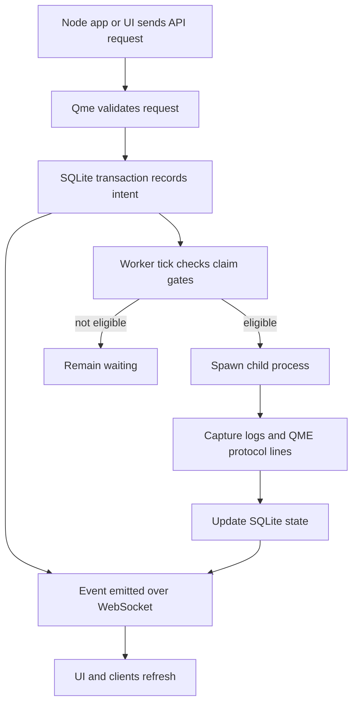
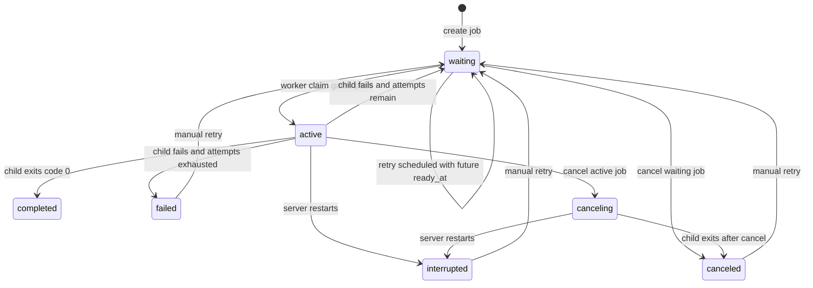
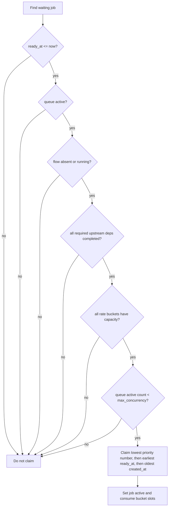
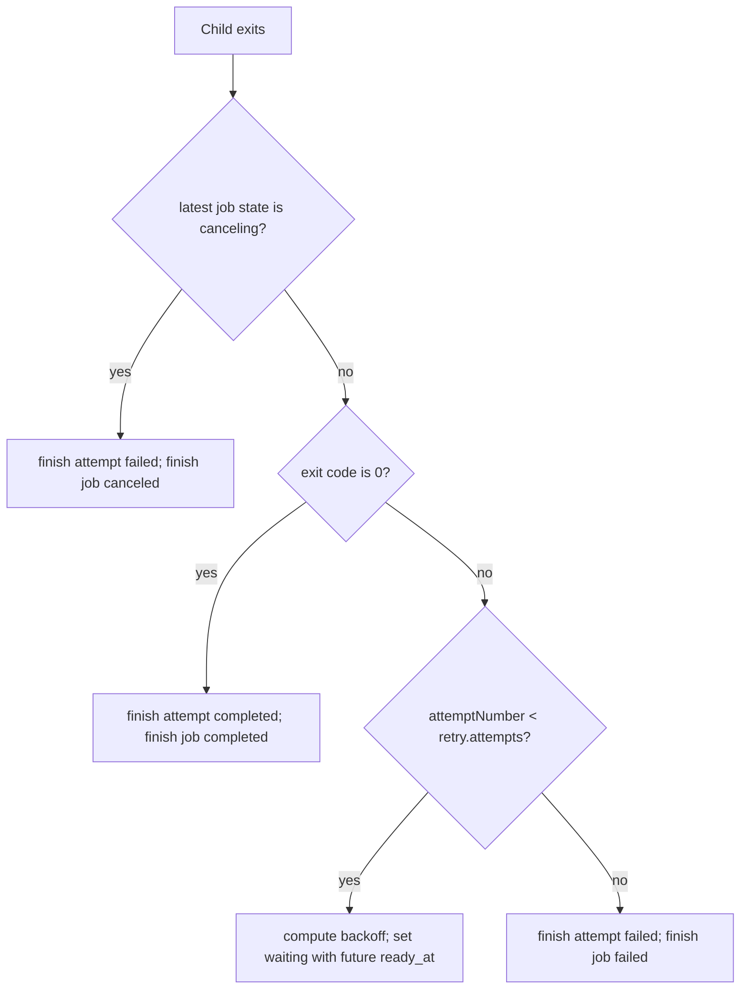
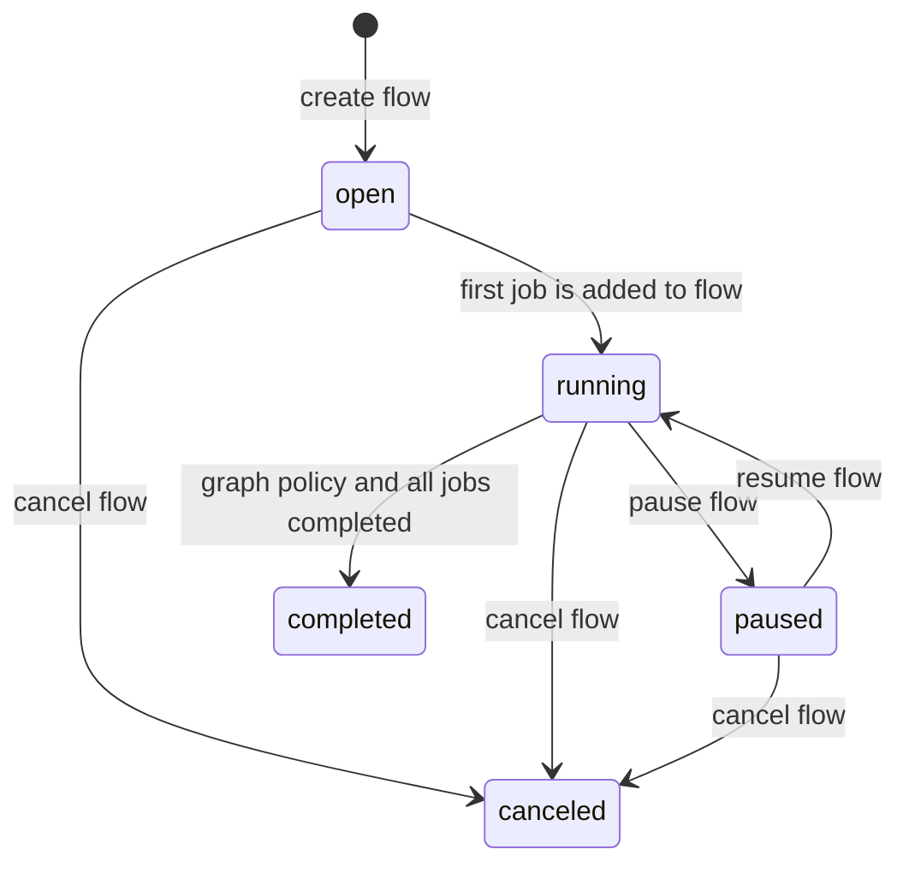
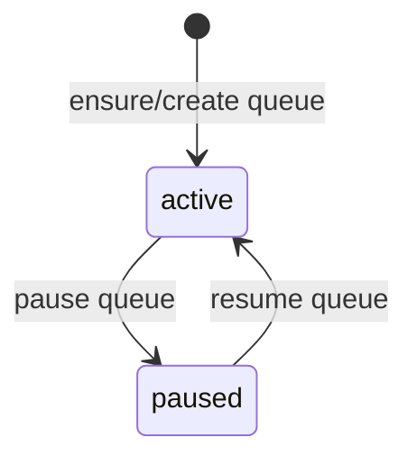
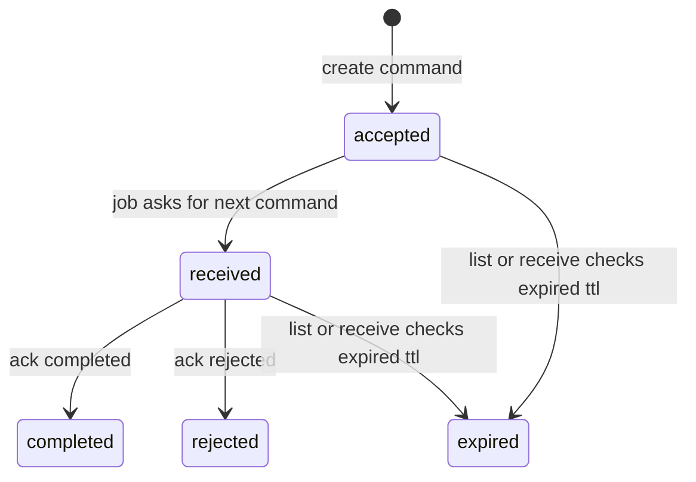
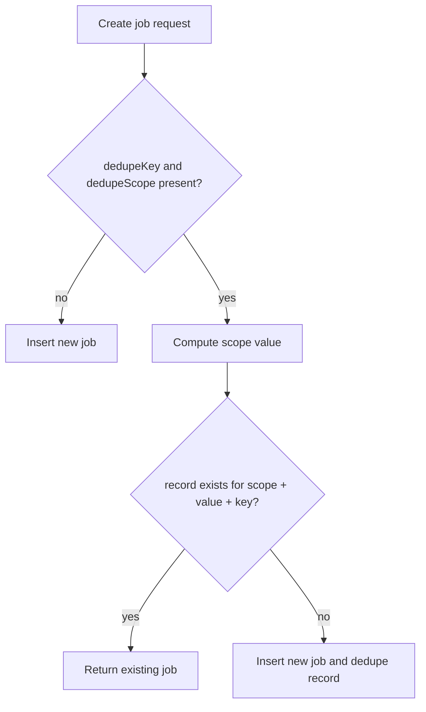
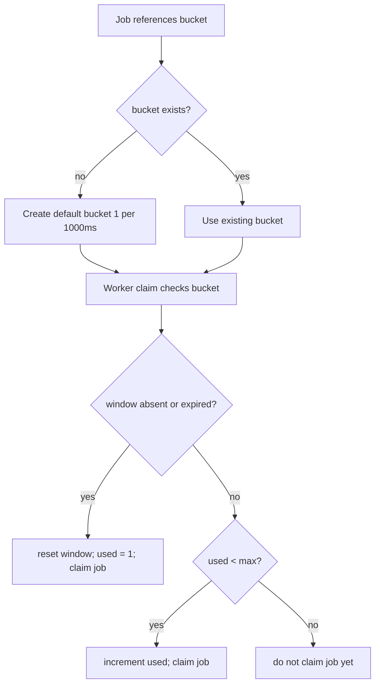
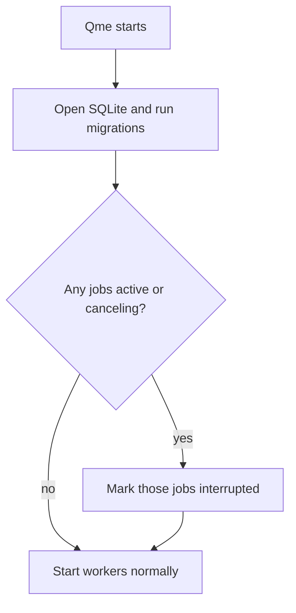

# Qme Decision Map

This document maps the states Qme currently takes, and the conditions that move work between those states.

It reflects the current implementation in:

- `packages/server/src/api.ts`
- `packages/server/src/db.ts`
- `packages/server/src/worker.ts`
- `packages/client/src/index.ts`

## System Loop

## Job States

| Current State | Entered When | Leaves When | Notes |
|---|---|---|---|
| `waiting` | A job is created, manually retried, or scheduled for retry | Worker claims it, user cancels it, or it stays blocked | Retry delay is represented by `ready_at`, not by a separate runtime timer. |
| `active` | Worker claims a `waiting` job | Child process exits, user cancels it, or Qme restarts | The child process is running. |
| `canceling` | User cancels an `active` job, or a flow cancels an active job | Worker observes process exit and records `canceled`, or restart records `interrupted` | Qme sends a kill signal, then escalates if needed. |
| `completed` | Child process exits with code `0` | Manual retry can move it only if code is changed later; currently not retryable | Terminal state. |
| `failed` | Child process exits non-zero and no attempts remain, or spawn validation fails | Manual retry | Terminal until retried. |
| `canceled` | Waiting job is canceled, or active job exits after cancel request | Manual retry | Terminal until retried. |
| `interrupted` | Qme starts and finds jobs in `active` or `canceling` | Manual retry | Protects against jobs being stuck forever after a crash/restart. |
| `retrying` | Type exists and flow cancellation accounts for it | Currently not directly used | Current implementation reschedules retries as `waiting` with a future `ready_at`. |

## Worker Claim Decision

A job can be claimed only when every gate below passes.

| Gate | Pass Condition | Failure Result |
|---|---|---|
| Job state | `state = 'waiting'` | Ignored by worker. |
| Delay | `ready_at <= now` | Stays waiting until ready. |
| Queue state | Queue is `active` | Stays waiting. |
| Flow state | Job has no flow, or flow is `running` | Stays waiting. |
| Dependencies | No required upstream job is non-completed | Stays waiting. |
| Rate limit | Every assigned bucket is either unused, expired, or below `max` | Stays waiting. |
| Concurrency | Active jobs in same queue are below `max_concurrency` | Stays waiting. |
| Ordering | Lower priority number wins; ties use `ready_at`, then `created_at` | Only one eligible job is claimed at a time. |

## Process Exit Decision

| Condition | Result |
|---|---|
| Spawn command cannot be resolved inside workspace roots | Job becomes `failed`. |
| Child exits with code `0` | Job becomes `completed`. |
| Child exits non-zero and attempts remain | Job returns to `waiting` with a new `ready_at`. |
| Child exits non-zero and attempts exhausted | Job becomes `failed`. |
| Child exits after cancellation was requested | Job becomes `canceled`. |
| Backoff is `fixed` | Delay is `retry.delayMs`. |
| Backoff is `exponential` | Delay is `retry.delayMs * 2 ** (attemptsUsed - 1)`. |

## Flow States

| Current State | Entered When | Leaves When | Notes |
|---|---|---|---|
| `open` | Flow is created | First job is added, or flow is canceled | Empty flows can stay open. |
| `running` | A job is created for an open flow, or a paused flow is resumed | Paused, canceled, or graph-completed | Worker only claims flow jobs when the flow is `running`. |
| `paused` | API calls `POST /flows/:id/pause` | Resumed or canceled | Existing active jobs are not killed by pause; waiting jobs stop being claimed. |
| `completed` | `completionPolicy = 'graph'` and every job in the flow is completed | No automatic transition out | Terminal in normal use. |
| `failed` | State type exists | Not currently set by the implemented failure path | With `failurePolicy = 'block'`, a failed job leaves the flow not completed. |
| `canceled` | API calls `POST /flows/:id/cancel`, or failure policy cancels the flow | No automatic transition out | Waiting/retrying jobs become canceled; active jobs become canceling. |
| `interrupted` | State type exists | Not currently set for whole flows on restart | Jobs can become `interrupted`; flows are not currently auto-marked interrupted. |

## Flow Completion And Failure Policies

| Policy | Condition | Current Behavior |
|---|---|---|
| `completionPolicy: "graph"` | `totalJobs > 0` and all jobs are `completed` | Flow becomes `completed`. |
| `completionPolicy: "explicit"` | Jobs complete | Flow does not auto-complete. |
| `failurePolicy: "block"` | A job fails | Flow remains in its current state; dependent jobs remain blocked by incomplete dependency. |
| `failurePolicy: "cancel"` | A job fails | Qme cancels the flow. |

## Queue States

| State | Entered When | Claim Behavior | Notes |
|---|---|---|---|
| `active` | Queue is created or resumed | Jobs may be claimed if all other gates pass | Default state. |
| `paused` | API calls `POST /queues/:queue/pause` | No new jobs are claimed | Active jobs keep running. |
| `draining` | Type exists | Not currently exposed by API | Future state. |
| `disabled` | Type exists | Not currently exposed by API | Future state. |

## Commands

| State | Entered When | Leaves When | Notes |
|---|---|---|---|
| `accepted` | UI/client sends command to an existing job | Job receives it, or TTL expires | Command creation does not currently require the job to be active. |
| `received` | Job calls `/jobs/:id/commands/next` | Job acks completed/rejected, or TTL expires | This is how AI AFK-style jobs receive instructions. |
| `completed` | Job or process calls `/commands/:id/ack` with `completed` | Terminal | UI can show the command was handled. |
| `rejected` | Job or process calls `/commands/:id/ack` with `rejected` | Terminal | Useful when an instruction is invalid. |
| `expired` | `listCommands` or `receiveNextCommand` notices `expires_at <= now` | Terminal | Expiration is lazy, not a background timer. |

## Dedupe Decision

| Dedupe Scope | Scope Value |
|---|---|
| `global` | The literal value `global`. |
| `queue` | The queue name. |
| `flow` | The flow id, or `no-flow` if no flow is attached. |

## Rate Limit Bucket Decision

| Condition | Result |
|---|---|
| Bucket does not exist when assigned to a job | Qme creates it as `max = 1`, `durationMs = 1000`. |
| Bucket window is absent or expired | Worker resets the window and consumes one slot. |
| Bucket window is active and `used < max` | Worker increments `used` and claims the job. |
| Bucket window is active and `used >= max` | Job stays waiting. |

## Restart Recovery

| Startup Condition | Result |
|---|---|
| DB has `active` jobs | They become `interrupted` with failure reason `Qme restarted before the job completed`. |
| DB has `canceling` jobs | They become `interrupted` with the same failure reason. |
| DB has waiting jobs | They remain waiting and can be claimed after startup. |
| DB has terminal jobs | They remain unchanged. |

## API Control Map

| API Action | Store Decision | Worker Decision | Event |
|---|---|---|---|
| `POST /queues/:queue/jobs` | Create waiting job, or return existing deduped job | Claimed on next eligible tick | `job.created` |
| `POST /flows` | Create open flow and optional jobs | Jobs can run once flow is running | `flow.created` |
| `POST /queues/:queue/pause` | Queue state becomes `paused` | New jobs in queue are not claimed | `queue.paused` |
| `POST /queues/:queue/resume` | Queue state becomes `active` | Waiting jobs may be claimed | `queue.resumed` |
| `POST /flows/:id/pause` | Flow state becomes `paused` | New jobs in flow are not claimed | `flow.paused` |
| `POST /flows/:id/resume` | Flow state becomes `running` | Waiting flow jobs may be claimed | `flow.resumed` |
| `POST /flows/:id/cancel` | Flow becomes canceled; waiting jobs canceled; active jobs canceling | Running children are killed | `flow.canceled` |
| `POST /jobs/:id/cancel` | Waiting becomes canceled; active becomes canceling | Running child is killed | `job.cancel_requested`, then `job.canceled` |
| `POST /jobs/:id/retry` | Failed/canceled/interrupted becomes waiting | May be claimed after delay | `job.retry_requested` |
| `POST /jobs/:id/priority` | Priority number changes | Lower number is claimed sooner | `job.priority_changed` |
| `POST /jobs/:id/commands` | Command becomes accepted | Worker does not consume it; job must poll | `command.accepted` |
| `POST /jobs/:id/commands/next` | First accepted command becomes received | Called by job process | `command.received` |
| `POST /commands/:id/ack` | Command becomes completed/rejected | None | `command.completed` or `command.rejected` |

## UI Read Model

| UI Area | Data Source | What It Means |
|---|---|---|
| Work metrics | `GET /metrics` | Current count of waiting, active, completed, failed, canceled, interrupted jobs plus flow and bucket counts. |
| Work flow list | `GET /flows` | Recent flow state and completion counts. |
| Work job list | `GET /jobs` | Recent jobs and their current state/progress. |
| Health rail | `GET /queues`, `GET /flows`, WebSocket state | Whether live events are connected and which queues exist. |
| Flows page | `GET /flows` | Flow state, origin app, policy, progress, and controls. |
| Queues page | `GET /queues` | Queue state, waiting depth, active count, concurrency, and controls. |
| Jobs page | `GET /jobs` | All recent jobs; selecting one opens detail. |
| Job details | `GET /jobs/:id/logs`, `GET /jobs/:id/commands` | Captured stdout/stderr logs and command lifecycle. |
| Rate Limits page | `GET /rate-limit-buckets` | Bucket policy and current window usage. |
| Store page | `GET /health`, `GET /metrics` | SQLite/discovery paths and persisted work counts. |

## Current Intentional Gaps

- `retrying`, `draining`, `disabled`, flow `failed`, and flow `interrupted` exist in the type model but are not fully driven by the current API/worker paths.
- Command expiration is lazy: it happens when commands are listed or fetched, not by a background cleanup loop.
- Pausing a queue or flow stops future claims; it does not suspend or kill already active jobs.
- Flow failure with `failurePolicy: "block"` does not currently mark the flow `failed`; it leaves dependent work blocked.
- The UI reads live state and offers controls, but it does not yet create flows/jobs from forms.
